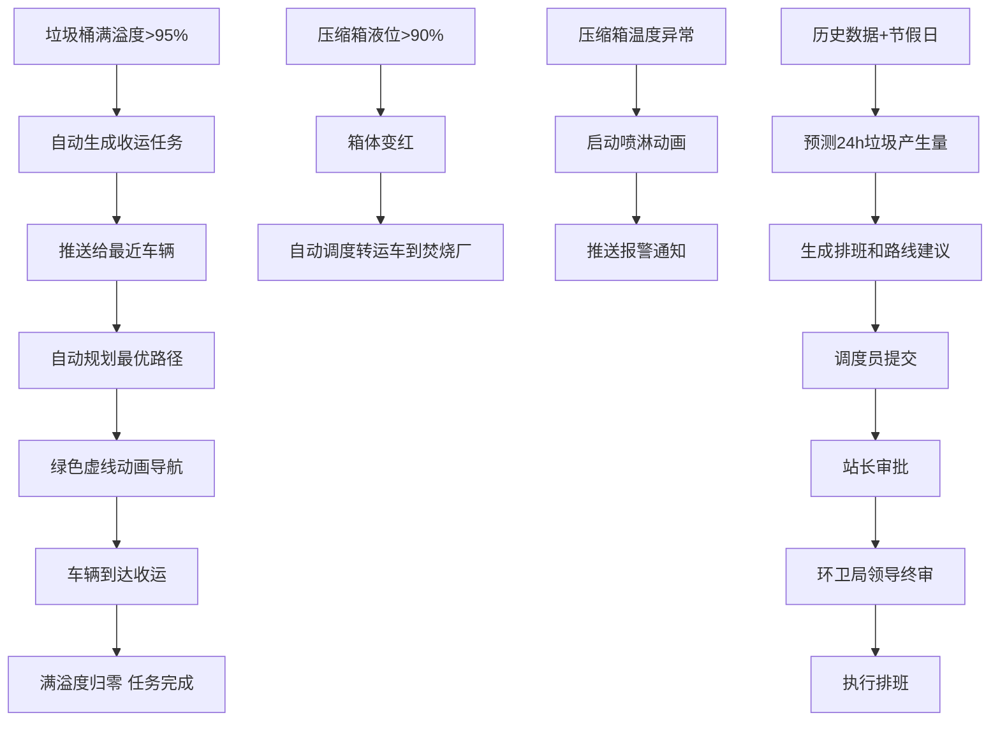

## 1. 产品概述

3D智慧城市垃圾分类收运与中转调度可视化平台，面向环卫管理部门，实现垃圾分类收运全流程的3D可视化监控、智能调度与决策支持。通过3D城市场景实时展示垃圾桶满溢状态、垃圾车运行轨迹、中转站设备状态，结合AI预测与三级审批机制，实现收运作业的智能化、精细化管理。

- 目标用户：环卫局领导、调度中心调度员、垃圾车驾驶员、中转站站长
- 核心价值：提升收运效率30%+，降低溢桶率至5%以下，实现设备故障分钟级响应

## 2. 核心功能

### 2.1 用户角色

| 角色 | 登录方式 | 核心权限 |
|------|----------|----------|
| 驾驶员 | 人脸识别 | 查看个人任务、路线导航、上报故障 |
| 调度员 | 人脸识别 | 全局监控、任务分配、路线规划、审批排班建议 |
| 环卫局领导 | 人脸识别 | 审批排班、查看统计报表、导出日报、全局配置 |

### 2.2 功能模块

1. **3D城市全景页面**: 3D城市场景总览，含居民小区垃圾桶、道路果壳箱、中转站压缩箱、转运车、调度中心建筑
2. **智能调度中心页面**: 任务面板、车辆监控面板、设备状态面板、预测排班面板
3. **数据报表页面**: 收运日报、车辆利用率、设备故障统计、投诉统计、Excel导出

### 2.3 页面详情

| 页面名称 | 模块名称 | 功能描述 |
|----------|----------|----------|
| 3D城市全景 | 居民小区垃圾桶 | 3D垃圾桶模型，显示编号/位置/满溢度/收运倒计时，满溢>80%变黄，>95%变红并自动生成收运任务 |
| 3D城市全景 | 道路果壳箱 | 果壳箱模型，同垃圾桶监控逻辑，位置沿道路分布 |
| 3D城市全景 | 中转站压缩箱 | 压缩箱模型显示液位和温度，液位>90%箱体变红并自动调度转运车到焚烧厂，温度异常启动喷淋动画 |
| 3D城市全景 | 转运车 | 实时显示编号、载重、当前路线，绿色虚线动画显示最优路径，多车交汇自动避让调序 |
| 3D城市全景 | 调度中心建筑 | 场景核心建筑标识，关联调度中心面板 |
| 3D城市全景 | 人员模型 | 头顶显示姓名和工种标签，进入压缩箱区域模型闪烁报警 |
| 3D城市全景 | 设备故障锁定 | 设备故障时模型变灰并锁定，自动生成维修工单弹窗 |
| 智能调度中心 | 任务面板 | 自动/手动收运任务列表，任务状态追踪，推送给最近车辆 |
| 智能调度中心 | 车辆监控面板 | 所有车辆实时位置、载重、状态，路线回放 |
| 智能调度中心 | 设备状态面板 | 压缩箱液位/温度趋势图，故障设备列表，喷淋状态 |
| 智能调度中心 | 预测排班面板 | 24h垃圾产生量预测曲线，节假日系数调整，车辆排班建议，路线优化建议 |
| 智能调度中心 | 三级审批流程 | 调度员提交→站长审批→环卫局领导终审，审批历史记录 |
| 数据报表 | 收运日报 | 按日期查看各区域收运量、车辆利用率、设备故障、投诉统计 |
| 数据报表 | Excel导出 | 按日期范围导出收运日报Excel，含所有统计维度 |
| 登录页 | 人脸识别登录 | 摄像头捕获人脸，匹配用户身份，记录登录日志 |

## 3. 核心流程

### 3.1 满溢自动收运流程
当垃圾桶满溢度超过95%时，系统自动生成收运任务，推送给距离最近且有空余载重的垃圾车，自动规划最优收运路径（绿色虚线动画），车辆到达后满溢度归零，任务完成。

### 3.2 中转站应急调度流程
压缩箱液位超过90%时，箱体变红，系统自动调度转运车辆将垃圾运往焚烧厂；温度异常时自动启动喷淋系统动画，同时推送报警通知。

### 3.3 预测排班审批流程
系统根据历史数据和节假日预测未来24小时各区域垃圾产生量，生成车辆排班和路线优化建议，经调度员提交→站长审批→环卫局领导终审三级审批后执行。

## 4. 用户界面设计

### 4.1 设计风格
- 主色调：深蓝黑(#0a1628)科技风背景，搭配青绿色(#00e5a0)科技感强调色
- 辅助色：警示黄(#ffc107)、报警红(#ff3d57)、正常绿(#00e676)
- 字体：思源黑体/Noto Sans SC，标题加粗，数据用等宽字体
- 布局：左侧3D场景占70%，右侧信息面板30%，顶部状态栏
- 图标风格：线性科技风图标，带发光效果
- 整体风格：赛博朋克科技大屏风格，深色主题，数据可视化密集呈现

### 4.2 页面设计概览

| 页面名称 | 模块名称 | UI元素 |
|----------|----------|--------|
| 3D城市全景 | 场景区域 | 深色3D城市场景，建筑半透明线框风格，地面网格，环境光+点光源，可旋转/缩放/平移 |
| 3D城市全景 | 垃圾桶标签 | 悬浮3D标签，编号+满溢度进度条+倒计时，颜色动态变化 |
| 3D城市全景 | 垃圾车 | 带编号标签的车辆模型，绿色虚线动态路径，载重进度条 |
| 3D城市全景 | 压缩箱 | 带液位柱和温度计的箱体模型，报警时发光闪烁 |
| 3D城市全景 | 人员 | 简化人形模型，头顶浮动姓名+工种标签，入侵时红色闪烁 |
| 智能调度中心 | 任务列表 | 左侧暗色面板，任务卡片带状态徽章，实时滚动更新 |
| 智能调度中心 | 预测曲线 | 24h预测面积图，蓝色渐变填充，当前时间竖线标记 |
| 智能调度中心 | 审批流程 | 步骤条组件，三级节点，待审批/已通过/已拒绝状态 |
| 数据报表 | 日报表格 | 暗色条纹表格，区域/收运量/利用率/故障/投诉列 |
| 数据报表 | 导出按钮 | 青绿色按钮，点击导出Excel文件 |

### 4.3 响应式设计
- 桌面端优先（1920x1080大屏展示）
- 最小支持1366x768分辨率
- 3D场景自适应容器尺寸

### 4.4 3D场景指引
- 环境：深色科技风城市，建筑为半透明线框/发光边缘风格
- 光照：环境光(0x1a2a4a, 0.6) + 方向光(0x00e5a0, 0.8) + 点光源标记关键区域
- 相机：透视相机，初始45度俯角，支持轨道控制旋转缩放
- 构图：中心为调度中心建筑，周围分布居民区和道路，边缘为中转站
- 交互：点击3D对象查看详情，鼠标悬停高亮，滚轮缩放
- 后处理：泛光效果(Bloom)，边缘发光
- 资源：程序化生成几何体，无外部模型文件，性能预算60fps
