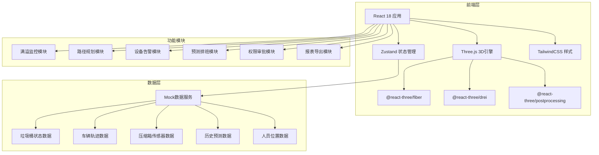
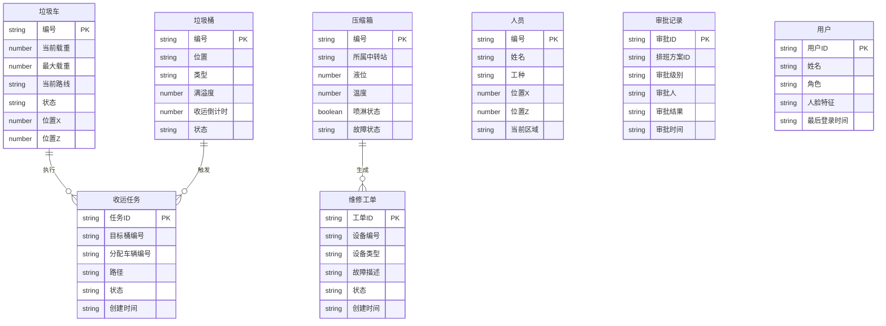

## 1. 架构设计

## 2. 技术说明

- 前端：React@18 + TailwindCSS@3 + Vite + TypeScript
- 初始化工具：vite-init
- 3D引擎：three + @react-three/fiber + @react-three/drei + @react-three/postprocessing
- 状态管理：zustand
- 路由：react-router-dom
- 后端：无（纯前端，使用Mock数据）
- 数据库：无（使用内存模拟数据+定时器模拟实时更新）
- 图表：recharts（预测曲线、趋势图）
- Excel导出：xlsx（SheetJS）
- 日期处理：dayjs

## 3. 路由定义

| 路由 | 用途 |
|------|------|
| / | 登录页（人脸识别登录） |
| /dashboard | 3D城市全景主页面（核心页面） |
| /dispatch | 智能调度中心页面 |
| /report | 数据报表与导出页面 |

## 4. 数据模型

### 4.1 数据模型定义

## 5. 核心算法说明

### 5.1 最优路径规划
- 使用贪心算法：每次选择距离当前位置最近且满溢度最高的桶点
- 路径以绿色虚线动画显示，使用Three.js的Line2+LineMaterial实现虚线效果
- 多车交汇时基于优先级和到达时间自动调整顺序

### 5.2 满溢度预测
- 基于历史数据的加权移动平均预测
- 节假日乘以系数（1.3-2.0）调整预测值
- 每15分钟更新一次预测结果

### 5.3 三级审批状态机
- 待提交 → 调度员审批中 → 站长审批中 → 环卫局审批中 → 已通过
- 任意环节可拒绝，拒绝后退回待提交状态
